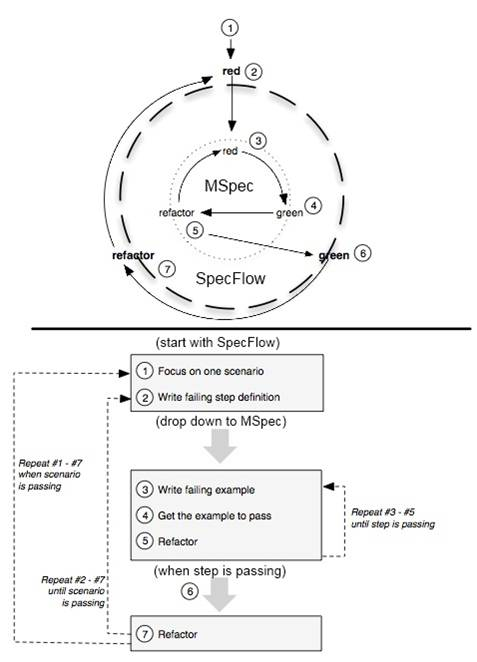

# The RSpec Book Behaviour-Driven Development with RSpec, Cucumber, and Friends

The one I possess is:
* Version: 2011-4-07
* P2.0 printing, May 2011

* Purchase from [here](https://pragprog.com/book/achbd/the-rspec-book)
* Review on [Goodreads](https://www.goodreads.com/book/show/6261920-the-rspec-book)

### Ruby and Gem Versions in my Book

* ruby - 1.8.7
* rubygems - 1.3.7
* rspec - 2.0.0
* rspec-rails - 2.0.0
* cucumber - 0.9.2
* cucumber-rails - 0.3.2
* database_cleaner - 0.5.2
* webrat - 0.7.2
* selenium-client -1.2.18
* rails - 3.0.0

### Ruby and Gem Versions I use in [Getting Started with Rspec and Cucumebr](https://github.com/mikaelblomkvist50/the-rspec-book/blob/master/GettingStartedWithRSpecAndCucumber.md)

* `$ ruby -v` = ruby 2.4.1p111 (2017-03-22 revision 58053) [x86_64-darwin17]
* `$  gem --version` = 2.6.14
* `$ rvm rubygems current` = Rubygems 2.6.14 already available in installed ruby, skipping installation, use --force to reinstall.
* `$ rspec -v` =
  * RSpec 3.7
    - rspec-core 3.7.1
    - rspec-expectations 3.7.0
    - rspec-mocks 3.7.0
    - rspec-support 3.7.1
* `$ rspec-rails -v` = -bash: rspec-rails: command not found
* `$ cucumber --version` = 3.1.0
* `$ cucumber-rails -v` = -bash: cucumber-rails: command not found
* `$ database_cleaner -v` = -bash: database_cleaner: command not found
* `$ webrat -v` = -bash: webrat: command not found
* `$ selenium-client -v` = -bash: selenium-client: command not found
* `$ rails -v` =
```
Rails is not currently installed on this system. To get the latest version, simply type:

    $ sudo gem install rails

You can then rerun your "rails" command.
```

[Forward](#https://github.com/mikaelblomkvist50/the-rspec-book#forward) **|**
[Chapter 1 Introduction](#https://github.com/mikaelblomkvist50/the-rspec-book#chapter-1-introduction) **|**
[Chapter 2 Hello](#https://github.com/mikaelblomkvist50/the-rspec-book#chapter-2-hello) **|**


### Forward

....this book is not for....Ruby programmers. ...If you read this book, that meme will change the way you program in Java, C#, Python, or (oh God, the thought) COBOL! This book will change the way you code--period! ....You see, they've cleverly constructed the Ruby code in this book so that it can be understood by (gasp) any programmer at all! -- Robert C. Martin

### Chapter 1 Introduction

....this is where the Test in `TDD` becomes a problem. Specifically, it is the idea of `unit testing` that often leads new `TDDers` to verify things such as making sure that a `register()` method stores a `Registration` in a `Registry`'s `registration` collection and that the collection is specifically an `Array`.

This sort of detail in a test creates dependency in the test on the internal structure of the `object` being tested. This dependency means that if other requirement guide us to change the `Array` to a `Hash`, this test will fail, even though the behaviour of the `object` hasn't changed. This is the primary reason for test suites to become ignored and, ultimately, discarded.

So if testing internals of an `object` is counterproductive in the long run, what should we focus on when we write these first?

The problem with testing an `object`'s internal structure is that we're testing what an `object` is instead of what it does. What an `object` does is significantly more important.

The same is true at the applicatin level. Stakeholders don't usually care that data is being persisted in an ANSI-compliant, relational database. They care that it's in "the database", but even then, they generally mean is that it's stored somewhere and they can get it back.

`BDD` puts the focus back on behaviour instead of structure, and it does so at every level of development. Whether we're talking about an `object` calculating the distance between two cities, another `object` delegating a search off to a third-party service, or a user-facing screen providing feedback when we provide invalid input, it's all behaviour!

Once we acknowledge this, it changes the way we think about driving out code. We begin to think more about interactions between people and systems, or between `objects`, than we do about the structure of the `objects`.

We believe that most of the problems that software development teams face are communication problems. `BDD` aims to help communication by simplifying the language we use to describe scenarios in which the software will be used: `Given` some context, `When` some even occurs, `Then` I expect some outcome.

`Given`, `When`, `Then`, the `BDD` triad, are simple words that we use whether we're talking about application behaviour or `object` behaviour. They are easily understood by business analysts, testers, and developers alike.


....for specifying application behaviour, we want something that communicates in broader strokes. And for that, we use `Cucumber`.

We use `Cucumber` to describe the behaviour of application and use `RSpec` to describe the behaviour of `objects`. With the addition of a higher-level tool like `Cucumber`, we'll actually have two concentric `red/green/refactor cycles`, as depicted in Figure 1.1(`MSpec = RSpec` and `SpecFlow` = `Cucumber`):



### Chapter 2 Hello

1. Crated file called `butler_spec.rb` with it's contents then make a directory called `spec` and move `butler_spec.rb` under it like so `spec/butler_spec`.

<pre><code>
$ <b>rspec butler_spec.rb</b>
1 deprecation warning total

Finished in 0.00889 seconds (files took 0.20208 seconds to load)
1 example, 0 failures
</pre></code>

2. Make a directory called `features` then create a file called `butler_says_hello.feature` with it's contents and move it under `features` like so `features/butler_says_hello.feature`

<pre><code>
$ <b>cucumber features</b>
Feature: butler says hello
  In order to start learning RSpec and Cucumber
  As a reader of the RSpec Book
  I want a butler to say Hello

  Scenario: butler says hello           # features/butler_says_hello.feature:7
    Given a butler                      # features/butler_says_hello.feature:8
    When I send it the greet message    # features/butler_says_hello.feature:9
    Then I should see "Hello Cucumber!" # features/butler_says_hello.feature:10

1 scenario (1 undefined)
3 steps (3 undefined)
0m0.050s

You can implement step definitions for undefined steps with these snippets:

Given("a butler") do
  pending # Write code here that turns the phrase above into concrete actions
end

When("I send it the greet message") do
  pending # Write code here that turns the phrase above into concrete actions
end

Then("I should see {string}") do |string|
  pending # Write code here that turns the phrase above into concrete actions
end
</pre></code>

3. To get the `scenario` to pass we need to store `step definitions` in a file that `Cucumber` can load. Go ahead and add a `step_definitions` directory under `features` like so `features/step_definitions`, and add a file named `butler_steps.rb` with the code snippets from above. Make sure to write code that turns the phrase above into concrete actions.

4. Run the `$ cucumebr features` again:
<pre><code>
$ <b>cucumebr features</b>
Feature: butler says hello
  In order to start learning RSpec and Cucumber
  As a reader of the RSpec Book
  I want a butler to say Hello

  Scenario: butler says hello           # features/butler_says_hello.feature:7
    Given a butler                      # features/step_definitions/butler_steps.rb:1
      uninitialized constant CucumberButler
      Did you mean?  Cucumber (NameError)
      ./features/step_definitions/butler_steps.rb:2:in `"a butler"'
      features/butler_says_hello.feature:8:in `Given a butler'
    When I send it the greet message    # features/step_definitions/butler_steps.rb:5
    Then I should see "Hello Cucumber!" # features/step_definitions/butler_steps.rb:9

Failing Scenarios:
cucumber features/butler_says_hello.feature:7 # Scenario: butler says hello

1 scenario (1 failed)
3 steps (1 failed, 2 skipped)
0m0.063s
</pre></code>

To keep it simple add the necessary code inside `features/step_definitions/butler_steps.rb` to pass all the test.

5. Run the `$ cucumebr features` again:
<pre><code>
$ <b>cucumebr features</b>
Feature: butler says hello
  In order to start learning RSpec and Cucumber
  As a reader of the RSpec Book
  I want a butler to say Hello

  Scenario: butler says hello           # features/butler_says_hello.feature:7
    Given a butler                      # features/step_definitions/butler_steps.rb:7
    When I send it the greet message    # features/step_definitions/butler_steps.rb:11
DEPRECATION: Using `should` from rspec-expectations' old `:should` syntax without explicitly enabling the syntax is deprecated. Use the new `:expect` syntax or explicitly enable `:should` with `config.expect_with(:rspec) { |c| c.syntax = :should }` instead. Called from /Users/mikaelblomkvist/the-rspec-book/GettingStartedWithRSpecAndCucumber/ch2-hello/features/step_definitions/butler_steps.rb:16:in `block in <top (required)>'.
    Then I should see "Hello Cucumber!" # features/step_definitions/butler_steps.rb:15

1 scenario (1 passed)
3 steps (3 passed)
0m0.047s
</pre></code>
